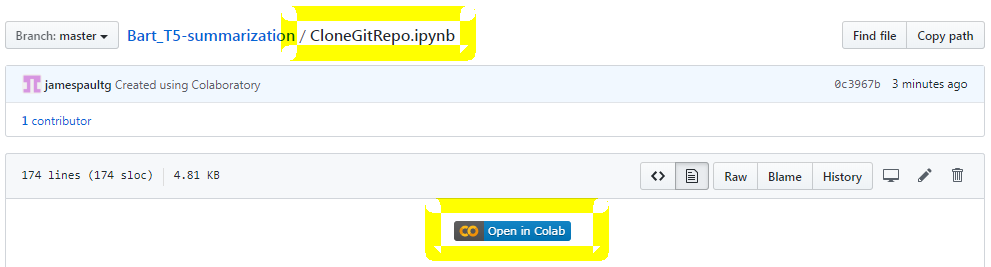

# Run the Text summarization Flask app from Google Colab
---
- Thanks to [Renato violin](https://www.linkedin.com/in/renato-violin-6681913b/) for building a Flask App to enable users to play around with Text summarization using BART and T5.
- His original github repo is https://github.com/renatoviolin/Bart_T5-summarization
- I changed the app.py to use ngrok and created this notebook that makes it easier for anyone to run this code in Google colab
- Note: ngrok provides tunnelling so that your local-hosted server can be accessed from outside the machine over the internet. Please refer https://ngrok.com/product for more details

## Run
To run the Flask app in Google colab, open the CloneGitRepo.ipynb in Google Colab**

## Bart_T5-summarization
Summarization Task using Bart and T5 models from [HugginFace Transformers](https://github.com/huggingface/transformers)

It is possible to directly compare the best models for text summarization Bart and T5.

### Bart Summarization

### T5 Summarization

